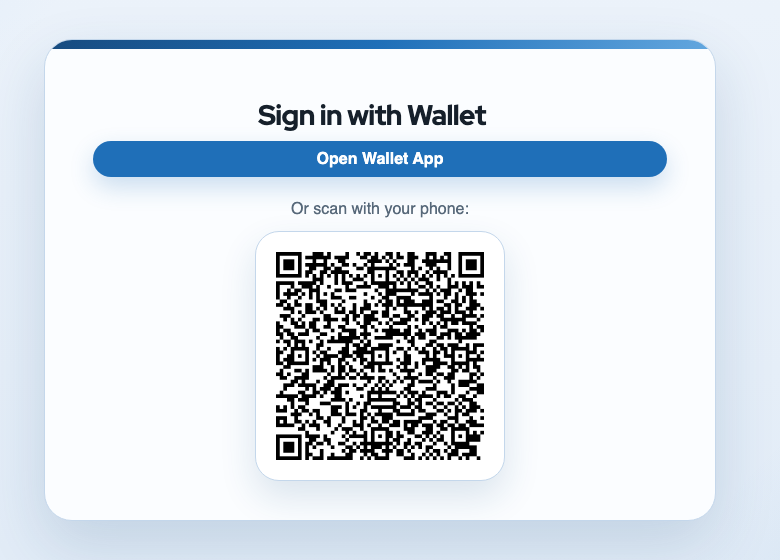
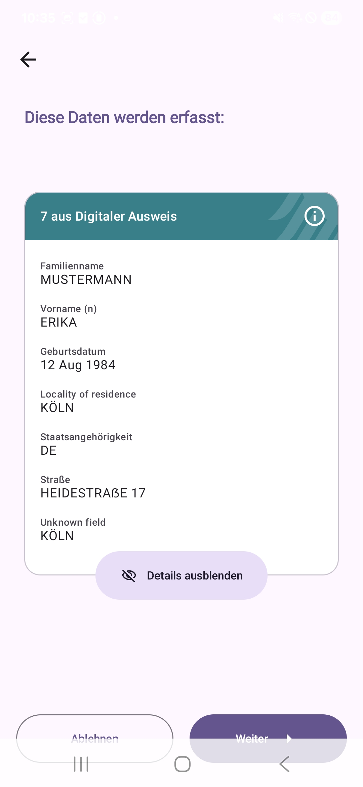

<script type="module">
  import mermaid from 'https://cdn.jsdelivr.net/npm/mermaid@10/dist/mermaid.esm.min.mjs';
  mermaid.initialize({ startOnLoad: true });
</script>

# **Keycloak and EUDI Wallet**

## A match made in heaven?

---

## Dominik Schlosser

Freelance Software Architect

- Years of experience in the IAM space
- Migrated a large German authority's online IAM to Keycloak
- Created/Helped create Keycloak extensions for Cassandra-backed storage, Push-MFA, BundID integration and more 

---


# EUDI-Wallet

- A digital wallet for identity, attestations, and signatures
- It reveals only the claims a service asks for
- Public-sector and regulated services will need wallet-based authentication

**Credential Issuance (OID4VCI):** Keycloak has experimental support
**Credential Verification (OID4VP):** Focus of this presentation

---



# What Wallet Login looks like in Keycloak

- Keycloak offers **Open Wallet App** for same-device and a QR for cross-device login
- The login page stays familiar and sits naturally in the Keycloak flow
- Cross-device login automatically continues the flow after finishing presentation in the wallet app

---



# What the wallet shows

- The wallet displays the exact requested claims before disclosure
- The user explicitly consents inside the native wallet app
- After consent, the verifier response completes the original Keycloak login

---

# OpenID4VP login flow

<div class="mermaid">
sequenceDiagram
    participant B as Browser
    participant KC as Keycloak
    participant W as Wallet
    B->>KC: Start wallet login
    KC->>B: Open wallet app or show QR
    B->>W: Launch wallet / scan QR
    W->>KC: Fetch signed request_uri
    W->>W: Show requested claims
    W->>KC: direct_post.jwt vp_token
    KC->>B: Complete authentication
</div>

---

# Diving deeper into the protocol

## DCQL request

```json
{
  "credentials": [{
    "format": "dc+sd-jwt",
    "meta": { "vct_values": ["eu.europa.ec.eudi.pid.1"] },
    "claims": [
      { "path": ["family_name"] },
      { "path": ["given_name"] },
      { "path": ["birthdate"] }
    ]
  }]
}
```

**Meaning:** Keycloak asks for exact claims from a specific credential type.

---

# Diving deeper into the protocol

## SD-JWT format

```text
issuer-signed JWT ~ disclosure 1 ~ disclosure 2 ~ ... ~ optional KB-JWT
```

- issuer-signed JWT carries digests for selectively disclosable claims in `_sd`
- each disclosure contains the salt, claim name, and claim value
- the wallet sends only the requested disclosures
- an optional key-binding JWT proves holder possession and binds the presentation to `aud` and `nonce`

**Meaning:** Keycloak asks for exact claims, and the wallet proves they came from the issuer-signed credential.

---

# From protocol to Keycloak implementation

| Protocol need                                                | Keycloak implementation                                     |
|--------------------------------------------------------------|-------------------------------------------------------------|
| External auth flow                                           | **Identity Provider SPI** and **SSE**                       |
| DCQL                                                         | **IdP mappers**                                             |
| Nonce, state, encryption keys                                | **Authentication session**                                  |
| Credential formats SD-JWT / mDoc                             | **Keycloak impl (SD-JWT)** and **com.authlete:cbor (mDoc)** |
| Credential verification (trust list, status list, integrity) | **Mostly custom (using Keycloak lib functionality)**        |
| Claim propagation to RPs                                     | **Protocol mappers / session notes**                        |

The extension is configured like any other identity provider in the Admin UI.

---

# Impl problem: Wallet callbacks are not browser redirects

- The wallet posts the result with `direct_post` or `direct_post.jwt`
- That callback comes from a **native app**, so no browser cookies come with it
- The extension solves this with:
  - stable `request_handle` per browser login attempt
  - deferred auth storage
  - `/complete-auth` to re-bind to the original browser session
  - **SSE** to wake up cross-device browser flows

---

# Wallet-Connector: Bridging the gap to OIDC-aware service providers / IdPs

- `eudi-wallet-connector` uses **transient users** (experimental feature)
- IdP is configured with **Do not store users**
- Verified wallet claims are mapped to **session notes**
- Those session notes are then exposed to relying parties via `id_token` and `userinfo`

Keycloak can act as a **Wallet-to-OIDC bridge** without persisting brokered users.

---

# Real-world problem: German PID lacks a unique identifier

- **You get:** `given_name`, `family_name`, ...
- **You do not get:** a stable account ID or subject for account linking
- **Current solution:** issue a second login credential with a stable `user_id` and query PID + custom credential using DCQL `credential_sets`

---

# `oid4vc-dev`

- My local testing wallet and protocol debugging project
- Simulate and inspect SD-JWT VC, mDOC, DCQL, and presentation requests without an actual wallet
- Useful for verifier development, regression testing, and understanding failing wallet flows
- There is also `testcontainers-oid4vc` for integration testing in Java

**Link:** https://github.com/dominikschlosser/oid4vc-dev

---

# Takeaways

- `keycloak-extension-oid4vp` extends Keycloak to **act as a Wallet-Verifier**
- `eudi-wallet-connector` adds **Wallet-support** to OIDC-aware service providers
- `oid4vc-dev` allows you to **test and debug** without a real wallet
- All of this works in **SPRIND's sandbox testing environment**
- Remaining issues will be addressed before go-live in 01/2027
- Integration into **Core Keycloak** is being discussed with the maintainers

---


# Thank You

- **Slides:** `ric03.github.io/presentation-keycloak-eudi-wallet/lightning.html`
- **Extension:** `github.com/ba-itsys/keycloak-extension-oid4vp`
- **Connector:** `github.com/ba-itsys/eudi-wallet-connector`
