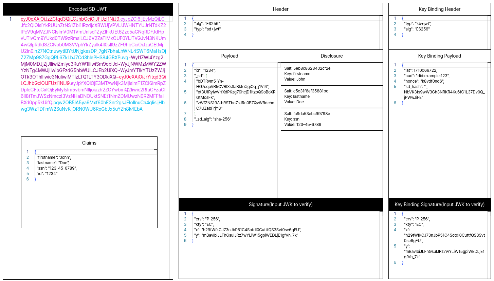

<script type="module">
  import mermaid from 'https://cdn.jsdelivr.net/npm/mermaid@10/dist/mermaid.esm.min.mjs';
  mermaid.initialize({ startOnLoad: true });
</script>

# **Keycloak and EUDI-Wallet**

### A match made in heaven?

<!--
Welcome everyone. Today we'll dive deep into how we integrated the EU Digital Identity Wallet with Keycloak. We'll cover the full stack from credential issuance to verification, and share what we learned building this for a real government customer.
-->

---

# Agenda

1. Introduction: EUDI-Wallet, Specs & Credential Types
2. **Credential Issuance** — OID4VCI with Keycloak
3. **Credential Presentation** — OID4VP Deep Dive
4. **Integrating OID4VP into Keycloak**
5. **Special Case: German PID Authentication**
6. Summary & Looking Ahead

<!--
We'll spend most of our time on OID4VP and the Keycloak integration since that's where the real complexity lives. I'll show real code from our implementation throughout.
-->

---


# EU Digital Identity — Wallet

- Authenticate with online services
- Store and share credentials selectively
- Sign documents electronically
- Receive and share government attestations ("Nachweise")

**Our focus today: Authentication via Keycloak**

<!-- footer: https://ec.europa.eu/digital-building-blocks/sites/spaces/EUDIGITALIDENTITYWALLET/pages/791609471/What+is+the+Wallet -->

---

# EU Digital Identity — Origins

- **eIDAS** — **e**lectronic **ID**entification, **A**uthentication and trust **S**ervices
  - 2016: eIDAS 1.0
  - 2024: eIDAS 2.0
- Independent sovereign solution for Europe
- Architecture and Reference Framework (ARF)

<!-- footer: https://github.com/eu-digital-identity-wallet -->

<!--
eIDAS 2.0 mandates that every EU member state must offer a digital identity wallet to its citizens. The ARF defines how everything fits together.
-->

---

# Specifications

## `OpenID4VCI`
- OpenID for **V**erifiable **C**redential **I**ssuance
- Protocol for issuing credentials to wallets

## `OpenID4VP`
- OpenID for **V**erifiable **P**resentations
- Protocol for requesting and verifying credentials

<!-- footer: "" -->

<!--
These two protocols are the backbone. VCI is about getting credentials INTO the wallet, VP is about getting them OUT for verification. Both build on top of OAuth 2.0.
-->

---

# Credential Types

**IETF `SD-JWT`** — Selective Disclosure for JWTs
- JSON-based, selective disclosure via salted hashes

**ISO `mDOC`** — Mobile Document
- CBOR-based, designed for proximity (NFC/BLE)



<!--
We support both formats in our implementation, but SD-JWT is the primary format in the German ecosystem. mDOC is mainly used for the mobile driving license.
-->

---

# EUDI Ecosystem — Roles & Interactions

```
┌──────────────────────────────────────────────────────────────┐
│                      Trust Anchor (TSL)                      │
│          Publishes trusted entity lists (ETSI TS 119 612)    │
└───────┬──────────────────┬───────────────────┬───────────────┘
        │ trusts           │ trusts            │ trusts
        ▼                  ▼                   ▼
┌───────────────┐  ┌──────────────┐  ┌──────────────────────────┐
│  Credential   │  │    Wallet    │  │ Verifier / Relying Party │
│  Issuer       │  │   (Holder)   │  │ (e.g. Keycloak)          │
└───────┬───────┘  └──┬───────┬───┘  └──────────┬───────────────┘
        │  OID4VCI    │       │      OID4VP     │
        └─────────────┘       └─────────────────┘

┌───────────────────────┐  ┌──────────────────────────────────┐
│ Attestation Provider  │  │ Status Provider                  │
│ Verifier Reg. Certs   │  │ Token Status Lists (revocation)  │
└───────────────────────┘  └──────────────────────────────────┘
```

<!--
This is the big picture. The Trust Anchor publishes trust lists so wallets can verify that issuers are legitimate, and verifiers can prove their identity. The Credential Issuer pushes credentials to the wallet via OID4VCI. The Verifier requests presentations from the wallet via OID4VP. The Attestation Provider issues registration certificates so verifiers can authenticate themselves. The Status Provider hosts revocation lists. Keycloak sits on the verifier side in our setup.
-->

---

<!-- _class: lead -->

# Credential Issuance
## OID4VCI with Keycloak

---

# Keycloak OID4VCI — Preview Feature

- Built-in support since Keycloak 24+ (preview)
- Implements the **Pre-Authorized Code Flow**
- Issuer metadata at `/.well-known/openid-credential-issuer`
- Credential signing using realm keys

<!--
Keycloak already has preview support for OID4VCI. It's not production-ready yet, but it gives us a foundation to build on. The pre-authorized code flow is simpler than the full authorization code flow because the user is already authenticated.
-->

---

# Pre-Authorized Code Flow

<div class="mermaid">
sequenceDiagram
    participant U as User
    participant KC as Keycloak
    participant W as Wallet
    U->>KC: Authenticate
    KC->>U: QR code (credential offer + pre-auth code)
    U->>W: Scan QR code
    W->>KC: Token request (pre-auth code)
    KC->>W: Access token + c_nonce
    W->>KC: Credential request + proof JWT
    KC->>W: Signed SD-JWT credential
</div>

<!--
The flow starts with the user authenticating normally. Keycloak then generates a credential offer containing a pre-authorized code. The wallet scans a QR code, exchanges the code for an access token AND a c_nonce. The nonce is used to build a proof-of-possession JWT, which the wallet sends along with the credential request. This proves the wallet controls the holder key that will be bound to the credential.
-->

---

# Credential Offer

```
openid-credential-offer://?credential_offer_uri=
  https://keycloak.example/realms/myrealm/protocol/oid4vc/credential-offer/abc123
```

Offer contains:
- `credential_issuer` — Keycloak realm URL
- `credential_configuration_ids` — which credentials
- `grants.pre-authorized_code` — one-time code
- Code expires after **5 minutes**

<!--
The credential offer URI uses a custom scheme so the wallet app can intercept it. The pre-authorized code is single-use and short-lived for security.
-->

---

<!-- _class: lead -->

# Credential Presentation
## OID4VP Deep Dive

---

# OID4VP — The Verification Protocol

A verifier needs to:
1. **Request** specific credentials and claims
2. **Authenticate** itself to the wallet
3. **Receive** the response securely
4. **Verify** the credential is valid and trustworthy

Each of these involves specific standards and mechanisms.

<!--
Let's go through each of these steps in detail. This is where most of the complexity lives.
-->

---

<style scoped>
.mermaid { margin: -80px 0 -40px 0; }
</style>

# OID4VP — Full Flow (Pass by Reference)

<div class="mermaid">
sequenceDiagram
    participant U as User/Browser
    participant V as Verifier
    participant W as Wallet
    U->>V: Trigger wallet login
    V->>U: openid4vp://?request_uri=...&client_id=...
    U->>W: Open wallet
    W->>V: Fetch request_uri
    V->>W: Signed request object JWT
    W->>W: Verify signature, show consent
    W->>W: Encrypt response (ephemeral key)
    W->>V: POST /response (JWE vp_token)
    V->>V: Decrypt & verify
    V->>U: Login success
</div>

<!--
This is the complete OID4VP flow using pass by reference. Instead of embedding the full request in the URL, we only pass a request_uri — a short URL pointing to the signed request object. The wallet fetches the actual request from that URI. This is important because the request object can be quite large — it contains the DCQL query, client metadata with encryption keys, and the verifier's registration certificate. Putting all of that into a QR code or redirect URL would be impractical. The request_uri keeps the initial redirect small and clean.
-->

---

# OID4VP & SIOPv2 — Extending OAuth / OIDC

Two specs that work together on top of OAuth 2.0 / OIDC:

| Spec | What it adds | `response_type` |
|------|-------------|-----------------|
| **OID4VP** | Verifiable Presentations | `vp_token` |
| **SIOPv2** | Wallet as Self-Issued OP | `id_token` |
| **Both** | Combined | `vp_token id_token` |

- **SIOPv2** — the wallet acts as its own OpenID Provider, issuing `id_token`s signed with the holder's key (no central IdP needed)
- **OID4VP** — adds `vp_token` for presenting verifiable credentials
- Both specs reuse the standard OAuth 2.0 authorization request/response flow
- HAIP / EUDI ecosystem primarily uses **`vp_token`** only

<!--
These two specs are companions. SIOPv2 — Self-Issued OpenID Provider version 2 — turns the wallet into its own identity provider. Instead of redirecting to Google or GitHub, the wallet itself issues an id_token signed with the holder's key. OID4VP builds on top of this and adds the vp_token response type for presenting verifiable credentials. You can use them independently or together. When combined, the verifier gets both a self-issued id_token and a verifiable presentation in one response. In the EUDI ecosystem, we almost exclusively use vp_token alone because the credential itself carries all the identity information we need. But SIOPv2 is relevant when you want a wallet-level identity assertion — for example to correlate the wallet instance itself across sessions.
-->

---

# DCQL — Digital Credentials Query Language

- Replaced the older `presentation_definition` format
- JSON-based query describing **what** the verifier needs
- Supports multiple credential types and formats
- Wallet decides **which** credentials satisfy the query

<!--
DCQL is the new way to express what credentials and claims you want from the wallet. It's much cleaner than the old presentation_definition format.
-->

---

# DCQL — Example Query

```json
{
  "credentials": [{
    "id": "pid_credential",
    "format": "dc+sd-jwt",
    "meta": {
      "vct_values": ["eu.europa.ec.eudi.pid.1"]
    },
    "claims": [
      { "path": ["family_name"] },
      { "path": ["given_name"] },
      { "path": ["birthdate"] }
    ]
  }]
}
```

<!--
This query asks for a PID credential in SD-JWT format, specifically requesting family name, given name, and birthdate. The wallet will only disclose these specific claims thanks to selective disclosure.
-->

---

# Client Authentication — client_id Schemes

How does the wallet know **who** is asking for credentials?

| Scheme | client_id format | Trust basis |
|--------|-----------------|-------------|
| `plain` | `https://example.com` | Pre-registration |
| `x509_san_dns` | `x509_san_dns:example.com` | X.509 certificate |
| `x509_hash` | `x509_hash:<base64url(sha256)>` | Certificate fingerprint |
| `verifier_attestation` | Varies | Trust anchor JWT |

<!--
The client_id scheme tells the wallet how to verify the verifier's identity. For production use, you'll want x509_san_dns or verifier_attestation. Plain is really only for testing.
-->

---

# x509_san_dns — How It Works

1. Verifier has an X.509 certificate with DNS SAN
2. Request object JWT includes certificate in `x5c` header
3. Wallet extracts DNS SAN from certificate
4. Verifies: SAN matches `client_id`, signature is valid

```java
// Computing the client_id from certificate
X509Certificate cert = parsePemCertificate(pemCertificate);
String dnsSan = cert.getSubjectAlternativeNames()
    .stream()
    .filter(san -> (Integer) san.get(0) == 2) // DNS type
    .map(san -> (String) san.get(1))
    .findFirst().orElseThrow();
return "x509_san_dns:" + dnsSan;
```

<!--
This is the scheme we use in production. The verifier's TLS certificate serves double duty — it proves domain ownership AND authenticates the authorization request.
-->

---

# Key Binding JWTs — The Chain of Trust

**Problem:** How does the verifier know the *presenter* owns the credential?

```
Issuer                        Wallet                      Verifier
  │                              │                            │
  │  1. Embed holder public key  │                            │
  │     in credential (cnf.jwk)  │                            │
  │  ───────────────────────►    │                            │
  │                              │  2. Sign KB-JWT with       │
  │                              │     holder private key     │
  │                              │  ──────────────────────►   │
  │                              │                            │
  │                              │  3. Extract cnf.jwk from   │
  │                              │     credential, verify     │
  │                              │     KB-JWT signature       │
```

The verifier **trusts the issuer** (via trust list) → the issuer **certifies the holder's public key** (via `cnf`) → the holder **proves possession** (via KB-JWT signature).

<!--
This is the chain of trust for key binding. During issuance, the issuer embeds the holder's public key in the credential's cnf claim. When presenting, the wallet signs a Key Binding JWT with the corresponding private key. The verifier extracts the public key from the credential — which it trusts because the issuer is on the trust list — and uses it to verify the KB-JWT signature. Without this, anyone who copies a credential could present it.
-->

---

# KB-JWT — Structure & Verification

```
Header: { "typ": "kb+jwt", "alg": "ES256" }
Payload: {
  "aud": "x509_san_dns:verifier.example.com",
  "iat": 1708700000,
  "nonce": "abc123",
  "sd_hash": "base64url(sha256(<JWT>~<disc1>~<disc2>~...~))"
}
Signed with: holder's private key (matching cnf.jwk in credential)
```

**Verifier validation:** extract `cnf.jwk` from credential → verify KB-JWT signature → check `sd_hash` matches full presentation → check `aud`, `nonce`, `iat` (max 5 min)

<!--
The sd_hash is computed over the ENTIRE SD-JWT presentation string — the issuer-signed JWT, a tilde, then all selected disclosures each followed by a tilde. This binds the KB-JWT to both the credential and the exact set of disclosed claims. The critical insight is that the verifier gets the holder's public key FROM the credential itself — which they trust because they've verified the issuer's signature against the trust list.
-->

---

# Response Modes

| Mode | Transport | Encryption | Use case |
|------|-----------|-----------|----------|
| `direct_post` | HTTP POST | No | Legacy / testing |
| `direct_post.jwt` | HTTP POST | JWE | Same-device redirect |
| `dc_api` | DC API callback | No | DC API (unencrypted) |
| `dc_api.jwt` | DC API callback | JWE | DC API (encrypted) |

<!--
These are the four response modes defined in OID4VP. The .jwt variants wrap the response in a JWE, the others send it unencrypted. HAIP mandates the encrypted variants.
-->

---

# HAIP — High Assurance Interoperability Profile

HAIP is the EU's profile for OID4VP, narrowing down options for interoperability:

| Area | HAIP Requirement |
|------|-----------------|
| **Signatures** | ES256 (ECDSA with P-256) only |
| **Response mode** | `direct_post.jwt` or `dc_api.jwt` |
| **Encryption alg** | ECDH-ES with P-256 |
| **Encryption enc** | A128GCM or A256GCM (prefer A256GCM) |
| **Credential formats** | SD-JWT VC (`dc+sd-jwt`) and mDOC |
| **Query language** | DCQL |

<!--
HAIP is critical because the OID4VP spec itself is very flexible — too flexible for a real ecosystem. Without HAIP, every implementer could make different choices about algorithms, response modes, and formats. HAIP narrows this down to a specific set that everyone must support. Think of it as the EU's "this is how we do it" profile. Notably, A128CBC-HS256 is NOT required — only GCM modes.
-->

---

# Encryption with Ephemeral Keys

<div class="mermaid">
sequenceDiagram
    participant V as Verifier
    participant W as Wallet
    V->>V: Generate ephemeral EC P-256 key
    V->>W: Request with public key in client_metadata
    W->>W: Encrypt vp_token (ECDH-ES + A256GCM)
    W->>V: JWE response
    V->>V: Decrypt with stored private key
</div>

Fresh key pair per request → forward secrecy.

<!--
Every authorization request gets its own ephemeral encryption key. The public half goes to the wallet, the private half stays in the server session. HAIP mandates ECDH-ES for key agreement with A256GCM for content encryption. This gives us forward secrecy — even if one key is compromised, other requests are unaffected.
-->

---

# Encryption — Client Metadata

```json
{
  "client_metadata": {
    "jwks": {
      "keys": [{
        "kty": "EC", "crv": "P-256",
        "alg": "ECDH-ES", "use": "enc",
        "x": "...", "y": "..."
      }]
    },
    "authorization_encrypted_response_alg": "ECDH-ES",
    "authorization_encrypted_response_enc": "A256GCM"
  }
}
```

<!--
This is what the client_metadata looks like in the request object. The wallet uses this ephemeral public key to encrypt its response using ECDH-ES key agreement with AES-256-GCM content encryption. HAIP requires support for both A128GCM and A256GCM, but recommends preferring A256GCM.
-->

---

# Credential Verification — ETSI Trust Lists

How do we trust that a credential was issued by a legitimate issuer?

1. Verifier fetches trust list from a **Trust Anchor** URL
2. Trust list is a **signed JWT** — verify the anchor's signature
3. Look up the issuer in the list → get their **X.509 certificate**
4. Verify the credential's signature against that certificate

<!--
Trust lists are the backbone of the EUDI trust model. They're published by trust anchors — typically national authorities — and list all authorized issuers with their certificates. Our verifier downloads these lists and uses them to verify credential signatures.
-->

---

# Trust List — Example Response (simplified)

```json
{ "trusted_entities": [{
    "entity_id": "https://pid-issuer.bundesdruckerei.de",
    "entity_name": "Bundesdruckerei PID Issuer",
    "trust_services": [{
      "type": "pid-issuance", "status": "granted",
      "x5c": ["MIIBjTCCATOgAwIBAgIUQ8..."]
    }]
  }, {
    "entity_id": "https://mdl-issuer.kraftfahrtbundesamt.de",
    "entity_name": "KBA mDL Issuer",
    "trust_services": [{
      "type": "mdl-issuance", "status": "granted",
      "x5c": ["MIICeTCCAiCgAwIBAgIUA2..."]
    }]
}] }
```

<!--
This is a simplified view of what a trust list contains. Each entity has an ID, a name, and one or more trust services with their X.509 certificates. When we receive a credential, we look up the issuer's entity_id in the trust list, extract the certificate, and verify the credential's signature. The trust list itself is signed by the trust anchor, so we need to trust only a single root certificate.
-->

---

# Disclosure Verification

## SD-JWT: `sd_hash`
- SHA-256 of the **full presentation string**: `<JWT>~<disc1>~...~`
- KB-JWT's `sd_hash` must match this hash
- Binds proof to credential **and** selected disclosures

## mDOC: `ValidityInfo`
- MSO contains `signed`, `validFrom`, `validUntil`
- Verifier checks all three timestamps
- Digest verification: SHA-256 of each `IssuerSignedItem`

<!--
For SD-JWTs, the sd_hash binds the key binding proof to the specific combination of credential and disclosed claims. It hashes the issuer-signed JWT followed by each selected disclosure, separated by tildes. For mDOC, the Mobile Security Object contains per-element digests and validity timestamps.
-->

---

# Credential Revocation — Token Status Lists

Issuer publishes a **Token Status List** (`statuslist+jwt`):
- DEFLATE-compressed byte array, base64url-encoded
- Supports **1, 2, 4, or 8 bits** per credential entry

| Bits | Status values                        |
|------|--------------------------------------|
| 1 | `0` = VALID, `1` = INVALID              |
| 2 | + `2` = SUSPENDED                       |
| 8 | Up to 256 application-specific statuses |

<!--
The Token Status List spec supports multi-bit entries so you can distinguish between revoked and suspended. The list is DEFLATE-compressed to keep it small even with millions of entries.
-->

---

# Status List — How Verification Works

**1.** Credential contains: `{ "status_list": { "idx": 42, "uri": "https://..." } }`

**2.** Verifier fetches the status list JWT from that URI:
```json
{ "status_list": { "bits": 2, "lst": "eNrbuRgAAhcBXQ" } }
```

**3.** Decode `lst` → base64url → DEFLATE-decompress → byte array
**4.** Read 2 bits at index 42 → `0x00` VALID, `0x01` INVALID, `0x02` SUSPENDED

Privacy-preserving: verifier fetches **entire list**, issuer can't tell which credential is checked.

<!--
The status list is a compact byte array distributed as a signed JWT. The verifier fetches it, verifies the JWT signature, base64url-decodes and DEFLATE-decompresses the lst field, then reads the bits at the credential's index. Because the entire list is fetched, the issuer has no way to know which specific credential is being checked — this is a deliberate privacy feature. The bits-per-entry field tells the verifier how many bits to read per credential entry.
-->

---

<!-- _class: lead -->

# Integrating OID4VP into Keycloak

---

# Architecture Overview

```
  User/Browser            EUDI Wallet
       │                       │
       ▼                       │
  ┌──────────┐                 │
  │ Keycloak │                 │
  └────┬─────┘                 │
       ▼                       │
  ┌──────────────────┐         │
  │  OID4VP Identity │◄───────►│
  │  Provider (SPI)  │         │
  └────────┬─────────┘
           ▼
  ┌──────────────────┐    ┌────────────────┐
  │   Credential     │───►│  Trust List    │
  │   Verifier       │    │  Service       │
  └──────────────────┘    └────────────────┘
```

<!--
Here's the big picture. We implemented the OID4VP verifier as a Keycloak Identity Provider using the broker SPI. This lets Keycloak treat wallet authentication just like any other external identity provider — like Google or GitHub login. The verifier component handles the cryptographic verification and consults trust lists to validate issuer certificates.
-->

---

# Identity Provider SPI

```java
public class Oid4vpIdentityProvider
    extends AbstractIdentityProvider<Oid4vpIdentityProviderConfig> {

    // Three authentication flows:
    // 1. DC API — W3C Digital Credentials API (Chrome)
    // 2. Same-device — HTTP redirect to wallet app
    // 3. Cross-device — QR code scanning
}
```

- Registered as a standard Keycloak IdP
- Configurable via Keycloak Admin UI
- Supports mapper-based claim extraction
- Session state management for security (nonce, encryption keys)

<!--
The identity provider SPI is the natural extension point in Keycloak for adding new authentication methods. Our implementation supports three different flows to handle different device scenarios.
-->

---

# Auto-Generating DCQL from Mappers

Instead of writing DCQL queries by hand:

1. Configure **IdP mappers** in Keycloak Admin UI
2. Each mapper specifies: format, credential type, claim path
3. `DcqlQueryBuilder` aggregates all mappers into a DCQL query

```java
DcqlQueryBuilder.fromMapperSpecs(objectMapper,
    credentialTypes,   // aggregated from mappers
    allRequired,       // require all credentials?
    purpose            // human-readable purpose
).build();
```

<!--
This is one of the nicest features of our implementation. Admins don't need to understand DCQL — they just configure mappers like they would for any other IdP, and the system generates the correct query automatically. If you need full control, you can still provide an explicit DCQL query.
-->

---

# Auto-Generated DCQL — How It Works

```
Mapper 1: SD-JWT / eu.europa.ec.eudi.pid.1 / family_name
Mapper 2: SD-JWT / eu.europa.ec.eudi.pid.1 / given_name
Mapper 3: SD-JWT / eu.europa.ec.eudi.pid.1 / birthdate
```
↓ generates ↓
```json
{ "credentials": [{
    "id": "cred1", "format": "dc+sd-jwt",
    "meta": { "vct_values": ["eu.europa.ec.eudi.pid.1"] },
    "claims": [{ "path": ["family_name"] },
               { "path": ["given_name"] },
               { "path": ["birthdate"] }]
}] }
```

<!--
The builder groups mappers by format and credential type, deduplicates, and produces a clean DCQL query. For mDOC credentials, it also handles the namespace-qualified claim paths correctly.
-->

---

# Client-Side: W3C Digital Credentials API

```javascript
const credential = await navigator.credentials.get({
  digital: {
    requests: [{
      protocol: "openid4vp-v1-signed",
      data: { request: requestObjectJwt }
    }]
  }
});
```

- Native browser API — no redirects, no QR codes
- Browser mediates wallet selection
- Best user experience for web-based verification

<!--
The Digital Credentials API is the future of wallet interaction on the web. The browser handles the wallet selection UI, similar to how WebAuthn works for passkeys. We provide a signed request object JWT, and the browser handles the rest. There's also an unsigned variant using protocol "openid4vp-v1-unsigned" where the request data is passed directly instead of as a JWT.
-->

---

# W3C Digital Credentials API — Browser Support

| Browser | Version | Status |
|---------|---------|--------|
| **Chrome** | 141+ (Sept 2025) | Shipped, enabled by default |
| **Safari** | 26+ (Sept 2025) | Shipped, **mdoc only** |
| **Firefox** | — | Negative standards position |

- Chrome 128 was an **origin trial** only — not shipped
- Android: native Credential Manager integration
- iOS 26+: native via `IdentityDocumentServices` framework
- Cross-device: QR/BLE handoff to mobile wallet

<!--
Chrome shipped the DC API enabled by default in version 141, not 128 as some sources claim. Chrome 128 was just an origin trial. Safari supports the API but only for the mdoc protocol — it does not support OpenID4VP at all. And Firefox has taken a negative standards position, citing privacy concerns. This fragmentation is a real challenge for relying parties.
-->

---

# DC API — Pitfalls and Considerations

**Protocol fragmentation:**
- Chrome: `openid4vp-v1-signed` and `openid4vp-v1-unsigned`
- Safari: `org-iso-mdoc` only — **no OpenID4VP support**
- Must implement dual protocols to support both browsers

**Practical issues:**
- Feature detection: `typeof DigitalCredential !== "undefined"`
- API changed: `navigator.identity.get()` → `navigator.credentials.get()`
  and `providers` → `requests`, `request` → `data`
- Trust verification is **your responsibility** — the API doesn't verify issuers

<!--
The biggest pitfall is Safari's lack of OpenID4VP support. If your users might be on Safari, you need to implement the ISO mdoc protocol as well, which is a completely different data format and verification model. The API surface also changed significantly during development, so older tutorials may show outdated syntax. And importantly, the browser doesn't verify trust — you still need your own trust list validation.
-->

---

# DC API — Fallback Strategy

Our login page supports all three flows:

1. **DC API** — try first if `DigitalCredential` available
2. **Same-device redirect** — fallback on mobile
3. **Cross-device QR code** — fallback on desktop

Each flow is independently toggleable in the IdP config.

<!--
We don't rely on any single flow. The login page detects browser capabilities and presents the appropriate option. DC API is preferred when available because it's the smoothest UX, but same-device redirect and QR code are always there as fallbacks. This is important because DC API coverage is still limited.
-->

---

# Client-Side: QR Code & Same-Device

**Same-device redirect:**
```
openid4vp://?client_id=x509_san_dns:example.com&request_uri=https://example.com/request/abc123
```

**Cross-device QR code:**
- Same URL encoded as QR code
- Displayed on the Keycloak login page
- Wallet scans and processes the request

Both use `direct_post.jwt` response mode.

<!--
For browsers that don't support the DC API, we fall back to redirects on mobile or QR codes for cross-device scenarios. The login page can be configured to show one or both options.
-->

---

# EUDI Wallet: Registration Certificate

The wallet needs to know it can trust the verifier.

**Ecosystem Registration Certificate:**
- Issued by a national Trust Anchor — JWT proving verifier is authorized
- Contains: organization name, purpose, allowed credentials

Included in the request as `verifier_info`:
```json
{ "verifier_info": [{ "format": "registration_cert",
    "data": "eyJhbGciOiJFUzI1NiIsInR5cCI6InJjLXJwK2p3dCJ9..." }] }
```

<!--
Registration certificates are the verifier equivalent of trust lists for issuers. They prove that the verifier has been formally registered and is authorized to request specific credential types. The wallet displays this information to the user before they consent to sharing.
-->

---

# Registration Certificate — Contents

```json
{
  "typ": "rc-rp+jwt",
  "sub": "https://verifier.example.com",
  "service": "Identity Verification Service",
  "contact": "support@verifier.example.com",
  "privacy_policy": "https://verifier.example.com/privacy",
  "credentials": [{
    "format": "dc+sd-jwt",
    "vct": "eu.europa.ec.eudi.pid.1",
    "claims": ["given_name", "family_name", "birthdate"]
  }],
  "public_body": false
}
```

<!--
The registration certificate explicitly lists which credentials and claims the verifier is allowed to request. The wallet can enforce this — if a verifier asks for more than they're registered for, the wallet should reject the request.
-->

---

<!-- _class: lead -->

# Special Case
## Authenticating with the German PID

---

# The Problem: No Identifying Claim

The German PID (Person Identification Data) contains:
- `family_name`, `given_name`, `birthdate`
- `nationality`, `age_over_18`, ...

**But no unique identifier!** No `id`, no `subject`, no `personal_id`.

How do you link a PID to a Keycloak user account?

<!--
This was our biggest challenge. Unlike a passport number or social security number, the German PID has no claim that uniquely identifies a person. Name plus birthdate isn't unique either — think about common names and shared birthdays.
-->

---

# Solution: Issue Our Own Credential

**Idea:** Issue a custom `login-credential` containing:
- `user_id` — Keycloak's internal user ID
- `linked_at` — timestamp of binding

Then query **both** PID and our credential in one request.

<!--
Our solution is to issue a supplementary credential that contains the binding to a Keycloak user. This credential lives in the user's wallet alongside their PID and is presented together during login.
-->

---

# Phase 1 — First Login (Enrollment)

<div class="mermaid">
sequenceDiagram
    participant U as User
    participant KC as Keycloak
    participant W as Wallet
    U->>KC: Present PID only
    KC->>U: "No account linked. Please log in."
    U->>KC: Username + Password
    KC->>KC: Issue login-credential
    KC->>U: QR code for credential offer
    U->>W: Scan and store credential
</div>

<!--
On first login, the user presents their PID but we can't match it to an account. So we ask them to authenticate with their existing credentials, then issue a supplementary login credential that gets stored in their wallet.
-->

---

# Phase 2 — Returning Login

<div class="mermaid">
sequenceDiagram
    participant U as User
    participant KC as Keycloak
    participant W as Wallet
    U->>KC: Start wallet login
    KC->>W: DCQL: PID + login-credential
    W->>KC: Both credentials
    KC->>KC: Extract user_id from login-credential
    KC->>U: Logged in!
</div>

<!--
On subsequent logins, the wallet presents both credentials. We extract the user_id from our custom credential for a direct O(1) lookup. The PID is still verified to ensure the person hasn't changed, but the actual account binding comes from our credential.
-->

---

# DCQL with credential_sets

```json
{
  "credentials": [
    { "id": "german_pid", "format": "dc+sd-jwt",
      "meta": { "vct_values": ["eu.europa.ec.eudi.pid.1"] },
      "claims": [{ "path": ["family_name"] }, ...] },
    { "id": "login_cred", "format": "dc+sd-jwt",
      "meta": { "vct_values": ["login-credential"] },
      "claims": [{ "path": ["user_id"] }, ...] }
  ],
  "credential_sets": [{
    "purpose": "Login with German eID",
    "options": [
      ["german_pid", "login_cred"],
      ["german_pid"]
    ]
  }]
}
```

<!--
Here's where credential_sets become essential. We prefer both credentials — that's the fast path, direct login. But if the user doesn't have our login credential yet, the wallet falls back to presenting just the PID, which triggers the enrollment flow. One query handles both scenarios.
-->

---

# PID Binding — Re-Enrollment

What if the user loses their `login-credential`?

- Wallet only presents PID → **enrollment flow triggers again**
- User authenticates with username/password
- Previous federated identity is removed
- New credential issued, new identity linked

The `credential_sets` fallback handles this automatically.

<!--
This is the beauty of the credential_sets approach. Lost credential? No problem. The same query naturally falls back to the PID-only option, and the system re-enrolls the user. No special error handling needed.
-->

---

<!-- _class: lead -->

# Summary & Looking Ahead

---

# A Match Made in Heaven? — Yes!

Keycloak already provides the foundations:

- **OAuth 2.0 / OIDC core** — OID4VP and OID4VCI are built on top of these
- **Identity Provider SPI** — natural extension point for wallet auth
- **Broker & Federation** — credential-based identity maps to federated identity
- **Mapper infrastructure** — claim extraction works like any other IdP
- **Realm key management** — signing and encryption keys already managed
- **Session management** — state, nonce, ephemeral keys fit naturally

The new features integrate nicely into existing architecture.

<!--
So, to answer the title question: yes, it really is a match made in heaven. Keycloak was designed to be extensible, and the verifiable credentials world is built on top of OAuth and OIDC — the very protocols Keycloak already implements. The broker SPI, mappers, session management — all of it maps cleanly to what we need for wallet authentication. We didn't have to fight the framework; we extended it naturally.
-->

---

# What We Built

- Full **OID4VP verifier** as Keycloak Identity Provider
- Support for **SD-JWT** and **mDOC** credentials
- Three authentication flows: **DC API**, **same-device**, **cross-device**
- **DCQL auto-generation** from IdP mappers
- **HAIP-compliant**: ES256, ECDH-ES + A256GCM, trust lists
- Solved **German PID** linking with supplementary credentials

<!--
Let me summarize what we've built. It's a complete OID4VP integration that handles the full verification pipeline — from building the request to verifying the response and establishing a Keycloak session.
-->

---

# Current Status

- Testing in the **German EUDI Wallet Sandbox**
- Working with the **Bundesdruckerei** reference wallet
- Validated against the **EU interoperability test suite**
- Used in a real project for a German public services customer

<!--
We're not just building this in a lab. It's being tested against real wallet implementations in the German sandbox environment, and it's being used in an actual customer project.
-->

---

# Next Steps

- **Release** the Keycloak extension on GitHub as open source
- **Reach out** to Keycloak maintainers and community
- Goal: contribute toward **integration into Keycloak Core**
- Collaborate on standardizing the IdP SPI approach

<!--
Our ultimate goal is to make this part of Keycloak itself. The EUDI wallet is going to be mandatory across the EU, and Keycloak needs first-class support for it. We're planning to open source our implementation and work with the community to make that happen.
-->

---

# Thank You!

Slides available at:
**https://ric03.github.io/presentation-keycloak-eudi-wallet/**

<!--
Thank you for your attention. I'm happy to take questions — especially about the technical details of the OID4VP integration or the German PID workaround.
-->
